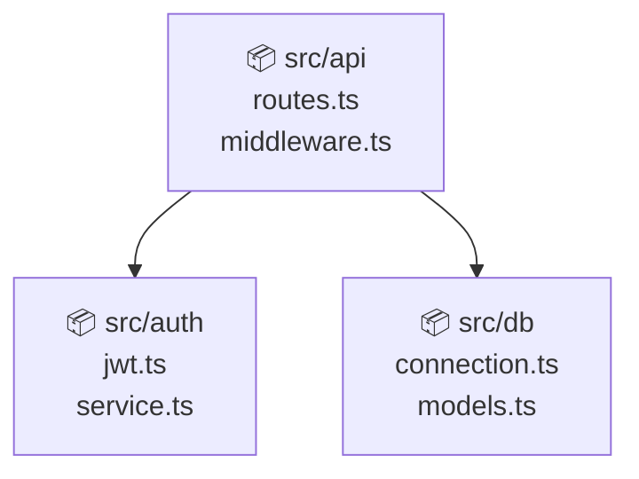

# codebase-gpt

> Ask your codebase questions. Local-first semantic knowledge graph + RAG.

[](https://www.npmjs.com/package/@phoenixaihub/codebase-gpt)
[](LICENSE)
[](https://github.com/phoenix-assistant/codebase-gpt/actions)

**codebase-gpt** is a local-first codebase intelligence CLI. No cloud, no API key required. It builds a knowledge graph of your code — functions, classes, imports, change coupling from git history — and lets you ask questions, map architecture, find experts, and track health.

## Features

- 🔍 **`ask`** — Ask questions in plain English, get answers with file/line references
- 🗺️ **`map`** — Auto-generate architecture diagrams (Mermaid) via community detection
- 👥 **`who`** — Find who knows about a topic based on git history
- 🏥 **`health`** — Complexity hotspots, dead code, bus factor, coupling anomalies
- 📋 **`diff`** — Summarize what changed and why, with coupling-aware warnings
- 🤖 **Optional LLM** — Set `OPENAI_API_KEY` for AI-enhanced answers (gpt-4o-mini)

## Install

```bash
npm install -g @phoenixaihub/codebase-gpt
```

Or use with npx:

```bash
npx @phoenixaihub/codebase-gpt index
```

## Quick Start

```bash
# 1. Index your codebase (run from project root)
codebase-gpt index

# 2. Ask questions
codebase-gpt ask "How does authentication work?"
codebase-gpt ask "Where is the database connection setup?"

# 3. Generate architecture map
codebase-gpt map

# 4. Find experts
codebase-gpt who "payment processing"

# 5. Health report
codebase-gpt health

# 6. What changed?
codebase-gpt diff --since v1.0.0
```

## Commands

### `codebase-gpt index`

Builds the knowledge graph. Parses TypeScript, JavaScript, Python, Go, Rust, Java. Analyzes git history for change coupling. Incremental — only re-parses changed files.

```
Options:
  -r, --root <path>   Root directory to index (default: auto-detected)
  -f, --force         Force full re-index
  -v, --verbose       Verbose output
```

**Sample output:**
```
🔍 Scanning files...
  Found 142 source files
🔗 Building import graph...
📊 Computing PageRank...
📝 Generating summaries...
🕰️  Analyzing git history...
  Found 1,203 commits, 87 coupling pairs

✅ Index built successfully
   Files indexed:   142
   Entities:        891
   Import edges:    203
   Coupling pairs:  87
```

### `codebase-gpt ask "<question>"`

Queries the knowledge graph. Uses TF-IDF search + graph traversal to find relevant code. If `OPENAI_API_KEY` is set, enhances with GPT-4o-mini.

```
codebase-gpt ask "How does the user authentication flow work?"
```

**Sample output:**
```
❓ Question: "How does authentication work?"

📍 Relevant code:

Functions / Classes:
  function authenticate @ src/auth/jwt.ts:23
    Validates JWT token and returns user session
  class AuthService @ src/auth/service.ts:45

Files:
  📄 src/auth/jwt.ts
    Functions: authenticate, signToken, verifyToken. Exports: authenticate, AuthService
```

### `codebase-gpt map`

Detects modules via Louvain community detection on the import graph. Outputs Mermaid diagram.

**Sample output:**
````
🗺️  Architecture Map


````

### `codebase-gpt who "<topic>"`

Ranks contributors by expertise (recency × frequency × scope).

**Sample output:**
```
👥 Who knows about "payment processing"?

🏆 Expert Ranking:

🥇 Alice Chen
   ██████████ 100% confidence
   Commits: 47 total, 12 recent (90d)
   Files touched: 8

🥈 Bob Smith
   ███████░░░ 71% confidence
   Commits: 23 total, 3 recent (90d)
   Files touched: 5
```

### `codebase-gpt health`

Comprehensive health report including hotspots, coupling anomalies, dead code, and bus factor.

### `codebase-gpt diff [--since <commit>]`

Summarizes changes grouped by area, with coupling-aware warnings for files that *should* have changed but didn't.

## Supported Languages

| Language | Functions | Classes | Interfaces | Imports |
|----------|-----------|---------|------------|---------|
| TypeScript | ✅ | ✅ | ✅ | ✅ |
| JavaScript | ✅ | ✅ | — | ✅ |
| Python | ✅ | ✅ | — | ✅ |
| Go | ✅ | ✅ (structs) | ✅ | ✅ |
| Rust | ✅ | ✅ (structs) | ✅ (traits) | ✅ |
| Java | ✅ (methods) | ✅ | ✅ | ✅ |

## Algorithms

- **Graph construction**: Regex-based AST parsing → entity extraction → edge creation
- **Change coupling**: Apriori-style co-occurrence on git commit sets
- **Community detection**: Greedy Louvain on import graph
- **PageRank**: Identifies core utilities and entry points
- **TF-IDF search**: Query matching over entity names + comments
- **Bus factor**: Shannon entropy on contributor distribution

## Index Location

The index is stored in `.codebase-gpt/index.json` in your project root. Add it to `.gitignore` (or commit it for team sharing):

```gitignore
.codebase-gpt/
```

## Large Repos

- Incremental indexing: only re-parses changed files (hash-based)
- Binary files are automatically skipped
- `node_modules`, `dist`, `build`, `vendor` are excluded

## License

MIT © Phoenix AI Hub

---

## CI Setup

```yaml
# .github/workflows/ci.yml
name: CI
on: [push, pull_request]

jobs:
  test:
    runs-on: ubuntu-latest
    steps:
      - uses: actions/checkout@v4
      - uses: actions/setup-node@v4
        with:
          node-version: 20
      - run: npm ci
      - run: npm test
      - run: npm run build
```

---

## Contributing

See [CONTRIBUTING.md](CONTRIBUTING.md).

